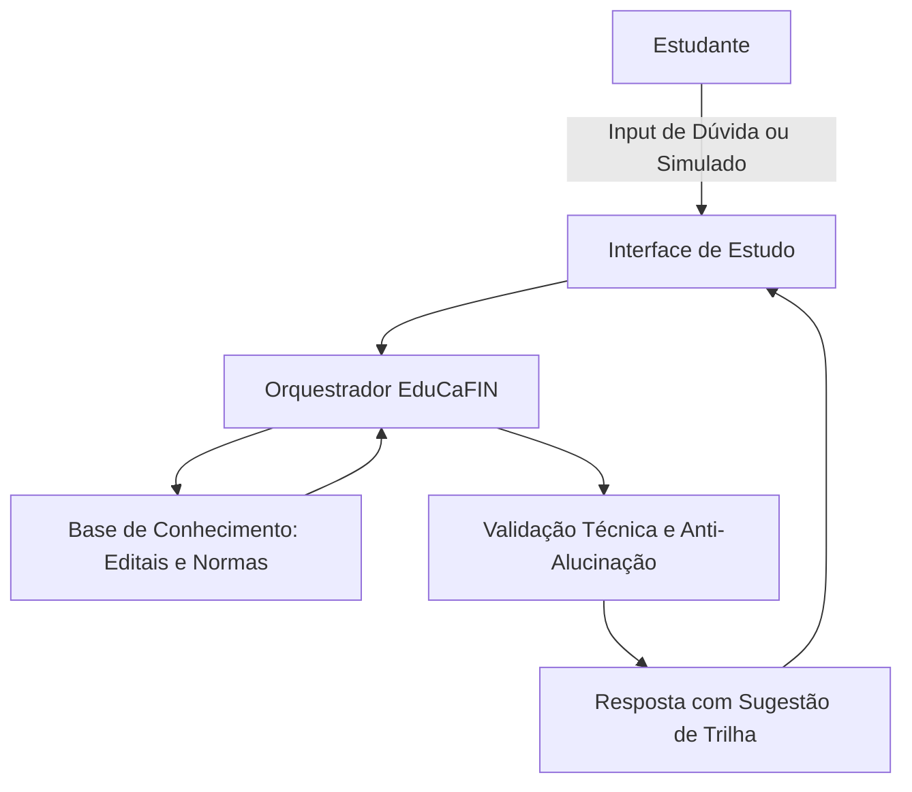

# Documentação do Agente: EduCaFIN

## Caso de Uso
### Problema
Prepara estudantes para tirar certificações no setor bancário (CPA-10, CPA-20, CEA, CFP, etc.).

### Solução
- **Simulados Inteligentes:** Gera questões inéditas alinhadas aos editais vigentes.
- **Análise de Gap:** A partir dos erros, identifica lacunas de conhecimento e sugere conteúdos específicos para reforço.
- **Trilha Personalizada:** Estrutura um cronograma de estudos adaptado ao nível de carreira (Junior/Estudante vs. Profissional em transição).

### Público-Alvo
Estudantes e profissionais de diversos níveis que buscam certificação para ingressar ou evoluir no mercado financeiro.

---

## Persona e Tom de Voz
- **Nome:** EduCaFIN
- **Personalidade:** Direto, educativo e assertivo. Atua como um mentor técnico focado em resultados.
- **Tom de Comunicação:** Formal e técnico, transmitindo credibilidade e autoridade sobre os temas bancários.

### Exemplos de Linguagem
- **Saudação:** "Olá. Sou o EduCaFIN. Qual certificação financeira vamos focar hoje? Podemos iniciar um simulado ou revisar seus tópicos de maior dificuldade."
- **Confirmação:** "Entendido. Processando seu desempenho no módulo de Renda Fixa para ajustar sua trilha de estudos."
- **Erro/Limitação:** "Este assunto não consta no edital da certificação selecionada. Recomendo concentrarmos nossos esforços nos tópicos de [Módulo X]."

---

## Arquitetura

### Diagrama de Fluxo

### Componentes

| Componente | Descrição |
|:--- |:--- |
| **Interface** | Dashboard de estudos desenvolvido em Streamlit para interação em tempo real. |
| **LLM** | GPT-4o via API para processamento de linguagem natural e raciocínio financeiro. |
| **Base de Conhecimento** | Banco de dados vetorial (RAG) com editais ANBIMA, CVM e manuais técnicos. |
| **Orquestrador** | Lógica em Python que gerencia o fluxo entre a dúvida do aluno e a base de dados. |
| **Módulo de Performance** | Algoritmo de análise que mapeia erros e gera a priorização da trilha de estudos. |
| **Validação** | Camada de verificação de consistência técnica para evitar alucinações regulatórias. |

## Segurança e Anti-Alucinação
- **RAG Prioritário:** O agente responde estritamente com base nos manuais e editais fornecidos.
- **Citação de Normas:** Respostas técnicas incluem a referência da norma ou instrução normativa (ex: "Segundo a Resolução CMN nº...").
- **Disclaimer de Investimento:** O agente não realiza recomendações de compra ou venda de ativos, limitando-se ao ensino teórico.

### Limitações Declaradas
- Não realiza inscrições em exames oficiais.
- Não fornece conselhos de investimento personalizados ou gestão de carteira.
- Não substitui a leitura integral dos códigos de ética das certificadoras.
